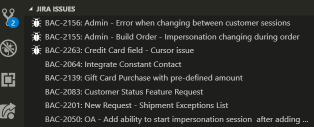

# Jira Issues

A simple extension for Jira aimed at showing you a filtered list of issues within vscode.

## Set up

You'll need to define the following settings before you start seeing any issues:

- `jira.baseUrl`
- `jira.username`
- `jira.apiToken` - [generate an api token](https://confluence.atlassian.com/cloud/api-tokens-938839638.html)
- `jira.port (default: 443)`
- `jira.password` - [DEPRECATED] Jira [no longer allows basic auth with password](https://confluence.atlassian.com/cloud/deprecation-of-basic-authentication-with-passwords-for-jira-and-confluence-apis-972355348.html). Field still "works" but expects an apiToken regardless.

## Custom filtering
By default you will see issues assigned to you that have not yet been resolved but you can provide your own JQL [(Jira Query Language)](https://confluence.atlassian.com/jirasoftwarecloud/advanced-searching-764478330.html) expression to filter issues exactly the way you want.

- `jira.jqlExpression`

For example the following expression will return all unresolved bugs assigned to you for the BAC project in the last 7 days in ascending order:

`assignee = currentUser() AND PROJECT = BAC AND issuetype = Bug AND resolution is EMPTY ORDER BY Rank ASC`

As you can see building your own JQL query gives you enormous power in building up a list of issues that are important to you. Its recommendable to type and test your JQL expression in Jira which has a wonderful typeahead that makes building a query extremely easy.

## Contributing

File bugs and feature requests in [GitHub Issues](https://github.com/crhistianramirez/jiraIssues/issues).

Checkout the source code in the [GitHub Repository](https://github.com/crhistianramirez/jiraIssues).

## License
[MIT](./License.md)